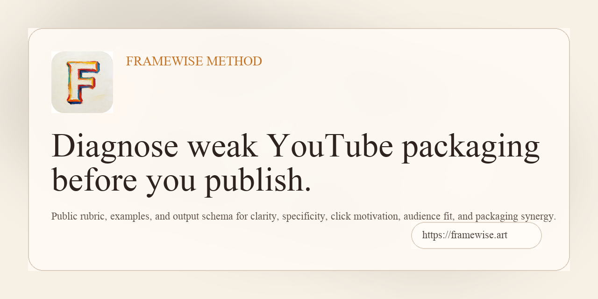

# Framewise Method

Public method notes for diagnosing YouTube packaging before publish.



[](https://framewise.art)
[](LICENSE)

Live product:

`https://framewise.art`

## Why this exists

Most creator tools jump straight to generating more titles.

Framewise starts one step earlier:

- What feels weakest in this package?
- Why was it flagged?
- What should be fixed first?

The core idea is simple:

`A lot of low CTR problems are packaging problems, not content problems.`

## What this repo is

This is the public method layer behind Framewise.

It is meant to be useful if you want:

- a clearer language for weak packaging
- a lightweight rubric for evaluating title + thumbnail decisions
- examples of bad vs better packaging
- a public-facing schema for explainable output

## What is public here

- packaging dimensions
- bad vs better examples
- diagnosis notes
- a lightweight output schema
- links back to the live evaluator and guide pages

## What is intentionally not public here

- production app source
- private environment configuration
- internal prompts and orchestration
- commercial implementation details
- full product logic and scoring internals

## The five packaging checks

Framewise currently evaluates packages across five dimensions:

1. Clarity
2. Specificity
3. Click Motivation
4. Audience Fit
5. Packaging Synergy

These checks are designed to catch issues like:

- the title is too vague
- the package does not signal who it is for clearly enough
- the click reason is not obvious fast enough
- the thumbnail and title repeat instead of helping each other

## Quick example

Same topic. Two very different packages.

Bad package:

`Faceless Channels Need This`

Better package:

`Why Most Faceless YouTube Channels Stay Stuck`

Why the second one is stronger:

- it names the audience
- it names the problem
- it gives a clearer reason to click

Main lesson:

Stronger packaging is usually not about sounding fancier.

It is about helping the right viewer understand, quickly:

- this is for me
- this is my problem
- this is why I should click

## Start here

- Read the dimension rubric: [rubric/packaging-dimensions.md](rubric/packaging-dimensions.md)
- See a bad vs better breakdown: [examples/bad-vs-better.md](examples/bad-vs-better.md)
- Read an audience fit example: [examples/audience-fit.md](examples/audience-fit.md)
- Read a low CTR diagnosis example: [examples/low-ctr-diagnosis.md](examples/low-ctr-diagnosis.md)
- See the public output shape: [schema/framewise-output-schema-lite.md](schema/framewise-output-schema-lite.md)
- Open the live product and guide links: [links/product-and-guides.md](links/product-and-guides.md)

## Repo structure

```text
framewise-method/
├── README.md
├── LICENSE
├── examples/
│   ├── bad-vs-better.md
│   ├── audience-fit.md
│   └── low-ctr-diagnosis.md
├── schema/
│   └── framewise-output-schema-lite.md
├── rubric/
│   └── packaging-dimensions.md
└── links/
    └── product-and-guides.md
```

## Who this is for

This repo is most useful for:

- YouTube creators
- faceless channel operators
- creator-tool builders
- people trying to think more clearly about packaging before publish

## Try the live product

If you want the actual evaluator instead of just the public method notes:

`https://framewise.art`
